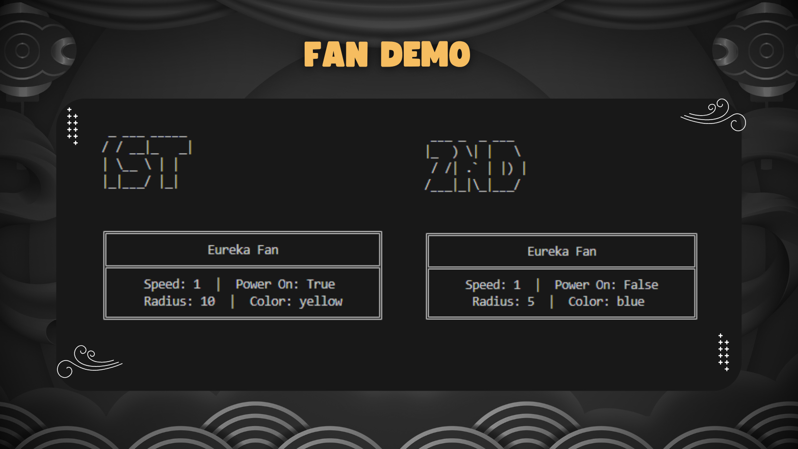
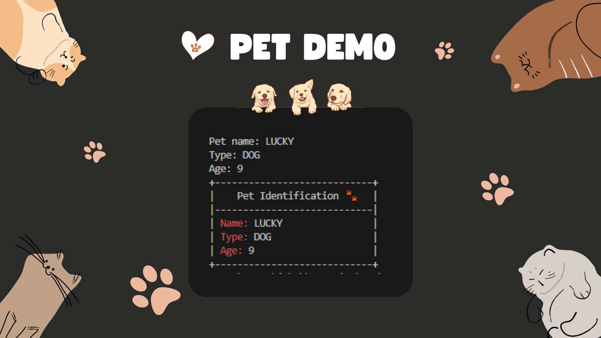

# Data Abstraction and Encapsulation
methods of interacting with and modifying protected data

## 🐱‍💻Programming Practices 

<h3> 🎐 The Fan Program </h3>

-----

This program creates fan objects, modifies their properties, and displays them on a formatted output. It consists of three programs:
1. fan_program.py: Contains the `Fan` which represents a fan object. It has attributes for speed, power status, radius, and color. The class provides getter and setter methods for each attribute to access and modify the fan's properties.
2. output_format.py: Defines the `Format` class, responsible for formatting and flaunting the fan's properties in a visually appealing bordered display.
3. test_fan.py: This is used to create instances of the `Fan` class and display their properties using the `Formatter` class. It demonstrates how to create fan objects, modify their properties, and print the formatted output.

<h3> 🚖 The Car Program </h3>

-----

This program Program simulates a car and provides a user interface for controlling its speed. It consists of three programs:
1. car_program.py: Contains the `Car` class that represents a car object with methods to accelerate, brake, get the current speed, and display speed-related information.
2. car_ui.py: Defines the `UI` class that provides a user interface with methods for displaying traffic lights, car sound effects, and a roadway.
3. test_car.py: This demonstrates the usage of the `Car` class and the `UI` class. It creates a car object, simulates traffic lights, accelerates, brakes, and stops the car.

**Card Demo**  

https://github.com/rei-kaizen/data-abstraction-encapsulation/assets/111290781/5fa42945-f8e0-4d84-89b0-9767be065570

<h3>  🐱‍🐉 The Pet Program </h3>

-----

This program allows you to have a pet identification card. You can input the pet's name, type, and age, and the program will generate an exquisite pet identification card with borders.  It consists of three programs:
1. pet_program: Contains a `Pet` class with data attributes for name, animal type, and age, along with methods for setting and getting the values of these attributes.
2. pet_ui: Defines a user interface class that generates a bordered layout for a pet identification card, with aligned text for the pet's name, type, and age.
3. test_pet: This takes user input for a pet's name, type, and age, and displays the pet's identification with framings and elements.

